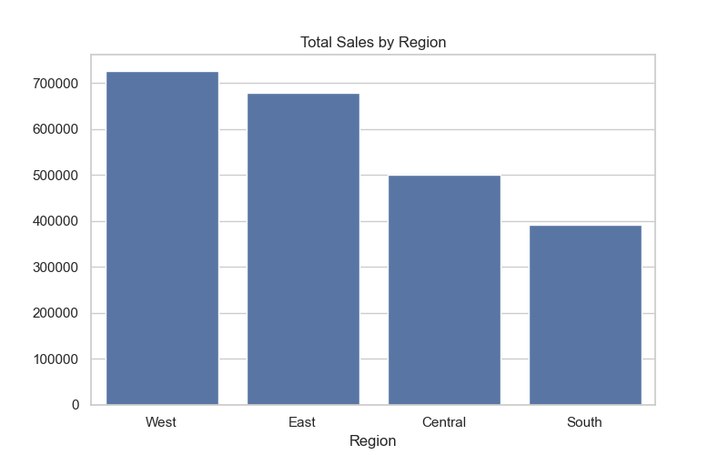
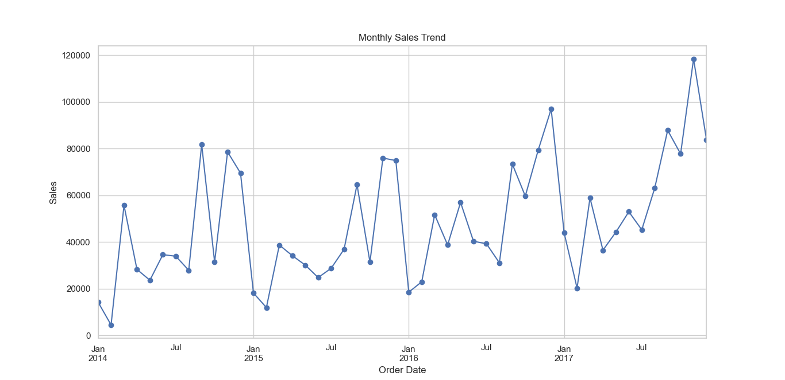
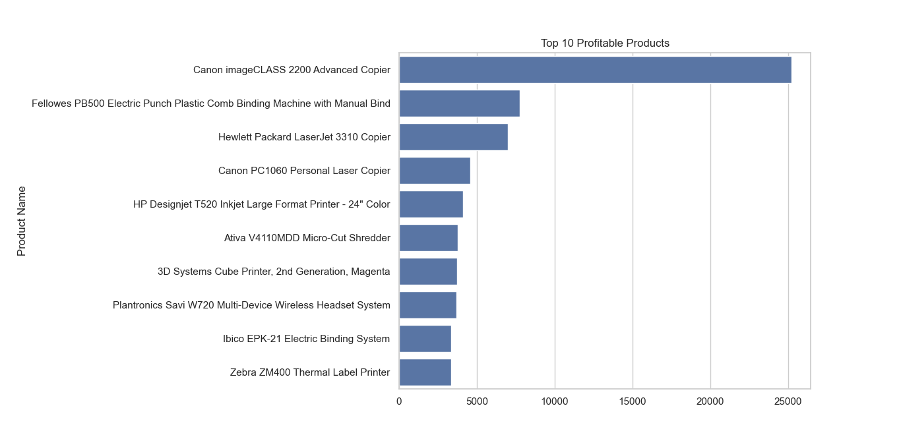

# 📊 E-Commerce Sales Analysis

## 📝 Project Overview
This project analyzes an e-commerce dataset to uncover key business insights and provide actionable recommendations.  
The analysis follows the data analytics process: **Ask → Prepare → Process → Analyze → Share → Act**.  

---

## Project Structure

- **data/** → contains the dataset(s) in CSV format  
- **images/** → saved charts, plots, and visuals  
- **notebooks/** → Jupyter notebooks with step-by-step analysis  
- **scripts** → optional Python script version of the analysis  
- **README.md** → project documentation  


---

## 🔧 Tools & Libraries
- Python  
- Pandas  
- Matplotlib & Seaborn  
- Jupyter Notebook  

---

## 🚀 Steps in the Project

### 1. Data Cleaning
- Removed duplicates  
- Converted dates into proper datetime format  
- Standardized categories  

### 2. Exploratory Data Analysis (EDA)
- Sales by region and category  
- Top 10 profitable products  
- Monthly/seasonal sales trends  

### 3. Visualization
- Bar charts, line charts, and trend analysis  

---

## 📸 Sample Visuals

Here are some example charts generated in the analysis:





---

## ✅ Insights & Recommendations
- Certain regions outperform others consistently → focus marketing efforts there  
- Seasonal peaks → increase inventory before festive months  
- Top 10 products contribute most revenue → ensure stock availability  

---

## 📦 How to Run This Project

1. Clone the repository:
   ```bash
   git clone https://github.com/yourusername/ecommerce-sales-analysis.git
